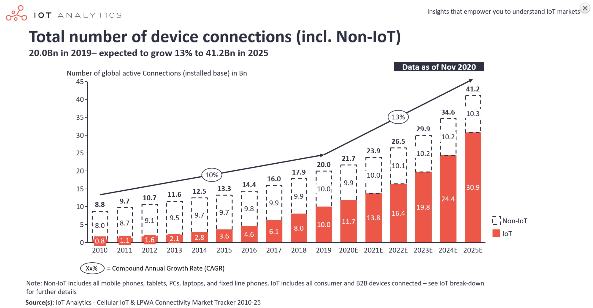
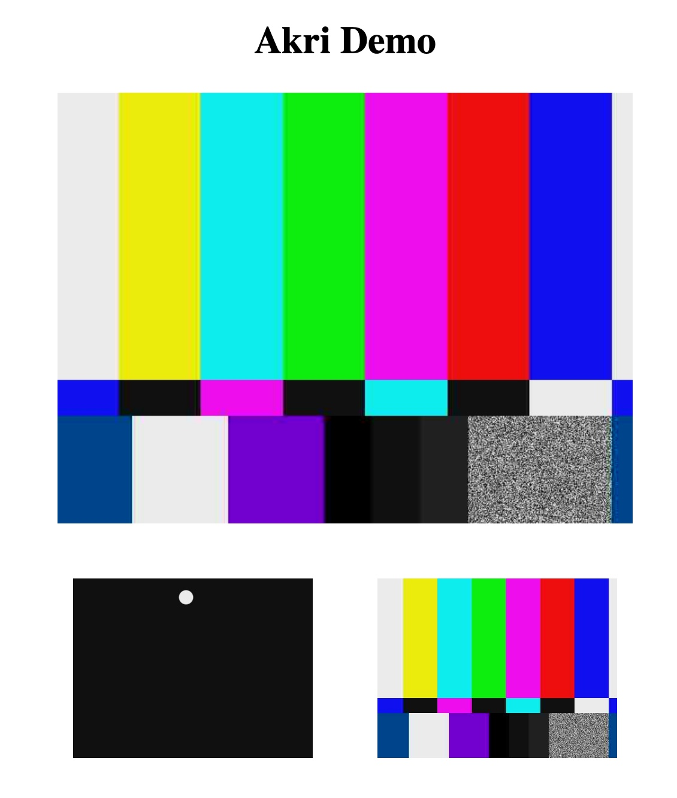
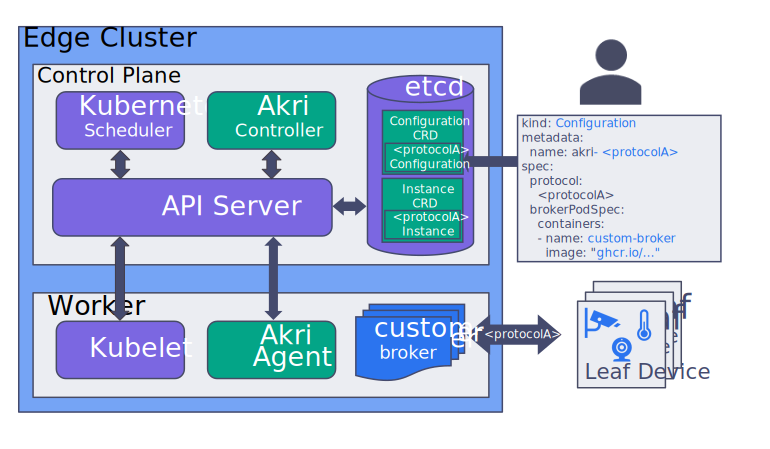

           

# Akri on MicroK8s


[](https://opensource.org/licenses/Apache-2.0)

* [Goal](README.md#goal)
* [Kubernetes On The Edge - Akri Architecture](README.md#kubernetes-on-the-edge-akri-architecture)
* [Workflow Actions](README.md##workflow-actions)
* [Fork & Run](README.md#how-to-fork--run)
* [Execution Report](README.md#execution-report)
* [Akri Helm Chart](README.md#akri-helm-chart)

## Goal

This repository delivers a fully scripted workflow (install + run - based on [microk8s-akri.yml](.github/workflows/microk8s-akri.yml) and [microk8s-akri.sh](sh/microk8s-akri.sh)) on GitHub CI / CD of the [end-to-end demo](https://github.com/deislabs/akri/blob/main/docs/end-to-end-demo.md) recently published by the [Akri project](https://github.com/deislabs/akri): it illustrates the use of video cameras (mocked here by test video streams) in Kubernetes edge workloads. The badge above gives status of our last execution (see also section [Execution Report](README.md#execution-report) for log excerpts) and details for all previous runs can be found in the [Actions tab](https://github.com/didier-durand/microk8s-akri/actions). Section [Akri Helm Chart](README.md#akri-helm-chart) provides the fully expanded version of the K8s objects used in this showcase.

Akri by Microsoft follows the Greek-based naming tradition of the Kubernetes arena: "akri" means ["edge" in Greek](https://en.wiktionary.org/wiki/%CE%AC%CE%BA%CF%81%CE%B7). Interestingly, the Akri acronym can also stand for "A Kubernetes Resource Interface". So, it's now clear that the project is all about edge computing and the [Internet of Things (IoT)](https://en.wikipedia.org/wiki/Internet_of_things) with its [30+ billions of connected objects](https://iot-analytics.com/state-of-the-iot-2020-12-billion-iot-connections-surpassing-non-iot-for-the-first-time/) to emerge in next five years: 4 connected objects per human being worldwide in 2025 as predicted by IoT Analytics.



The workflow is also automatically scheduled by cron (see [microk8s-akri.yml](.github/workflows/microk8s-akri.yml)) on GitHub on a recurrent basis to validate that it keeps working properly while its various components keep evolving: new versions of Akri, MicroK8s, Ubuntu, etc. [MicroK8s defined as](https://microk8s.io/) *'autonomous, production-grade Kubernetes, on cloud, clusters, workstations, Edge and IoT'* is used here because its source code is extremely close to the upstream version of Kubernetes: this feature guarantees the widest possible range of use cases for those workloads making sophisticated use of the K8s features. We have already used it for same reasons in our scripted showcases for [Kube Bench](https://github.com/didier-durand/microk8s-kube-bench) and [Kata Containers](https://github.com/didier-durand/microk8s-kata-containers).

Section [Workflow Actions](README.md#workflow-actions) below details the sequence of actions needed to reach a working deployment starting from a fresh Ubuntu instance launched on Google Cloud Engine (GCE): we currently use a [n1-standard-4](https://cloud.google.com/compute/docs/machine-types#n1_machine_types) instance.

The workflow execution finally delivers the command(s) needed to obtain remote access on GCE to both the standard Kubernetes dashboard and the Akri demo application from the browser on your laptop: web pages similar to the ones below will be reached.

Feel free to fork and re-use! (Of course, if you like it, please, give it a star)

When you reach the end of workflow execution, you will be able to access, from your local browser two different applications produced by the pods of your MicroK8s cluster running on GCE. To allow port forwarding over ssh toward your laptop, you need to have gcloud SDK installed locally and to enter the following terminal command  `gcloud compute ssh microk8s-akri --zone=us-central1-c  --project=$GCP_PROJECT  --ssh-flag='-L 3443:localhost:3443 -L 12321:localhost:12321'`. Then,


1. `http://localhost:12321` will get you to the Akri demo application. At the bottom, permament images (updated at 1 fps) of the 2 fake cameras: the first with a bouncing ball, the second one with a colour carrousel. The top image shifts from one camera to the other every few seconds.
2. `http://localhost:3443` will get you to the standard Kubernetes dashboard showing all details above the 11 active pods. You need to obtain the security token from the final lines of the execution log to authentify with the dashboard.

   

(click on pictures above to enlarge them)

## Kubernetes On The Edge - Akri Architecture

Recent [announcement by NIVIDIA](https://nvidianews.nvidia.com/news/global-technology-leaders-adopt-nvidia-egx-edge-ai-platform-to-infuse-intelligence-at-the-edge-of-every-business) demonstrates that [Moore's Law](https://en.wikipedia.org/wiki/Moore%27s_law) remains in full force: installing a K8s microcluster on the edge is definitely possible now! The needed computing power with minimal form factor is available today and can serve even demanding edge ML / AI workloads.

One of the key differences between Kubernetes in the (public) cloud and Kubernetes on the edge is that, on the edge, workloads often require a variety of physical devices, like sensors, cameras and other leaf devices. Those leaf devices are single-purpose and limited: usually, no opportunity to load any additional software on them in order to make them multi-purpose or to become a member node of a Kubernetes cluster.

But the project team wanted those devices to remain easy to integrate with cloud-native workloads while keeping the resulting global system agile and flexible. So, they took the (_smart_) decision of treating the devices as resources and not compute nodes. Consequently, they designed some custom controllers and resources to dynamically discover the devices and expose them to applications as standard [Kubernetes Custom Resources](https://kubernetes.io/docs/concepts/extend-kubernetes/api-extension/custom-resources/), easy to access and manipulate using the standard mechanisms and features of the platform. 

Akri's architecture is very well depicted by the diagram below coming from the [project introductory blog post](https://cloudblogs.microsoft.com/opensource/2020/10/20/announcing-akri-open-source-project-building-connected-edge-kubernetes/).



This post details the various components in full detail: a must-read! The recent [presentation video](https://www.youtube.com/watch?v=ZbTLGuxH1UA) and [Edge conference slides](/doc/Edge-Conference-Slides.pdf) bring additional interesting information.

This architecture doesn't impose any overhead at all on the devices themselves. But, more importantly, at least to our mind, it keeps all software components of the global application within Kubernetes.

The interests are multiple: 
1. It keeps application developers, familiar with Kubernetes, in known territory: for edge workloads. they keep developing with K8s concepts, objects & APIs that they know very well for cloud applications.
2. It leverages the advantages of cloud-native architecture end to end: powerful abstraction of infrastructure, smallest possible lead time from dev to prod, automatic updates for new versions, etc. Operations remain fully homogeneous: the full edge stack can be managed by deployment and management mechanisms and tools (new container versions, compliance validation, etc.) already mastered for central workloads on cloud Kubernetes. So, no need to plan for additional processes and tools, specific to edge software that would reside outside of Kubernetes.
3. The use of advanced but standard features like [Custom Resources](https://kubernetes.io/docs/concepts/extend-kubernetes/api-extension/custom-resources/) and associated Controllers makes Akri easily extensible by the community. The team already announces the support of additional device protocols in upcoming releases: currently, [Open Network Video Interface Forum (ONVIF)](https://en.wikipedia.org/wiki/ONVIF) for IP cameras and [Linux udev (userspace /dev)](https://en.wikipedia.org/wiki/Udev) to manage hotplug-capable devices are supported. Beyond community contributions, the respect of the K8s standards will maximize Akri's composability, hence the added value that it delivers.

Regarding existing protocols, detailed instructions to configure the [Helm chart](https://helm.sh/docs/topics/charts/) for both protocols are provided: [udev configuration guide](https://github.com/deislabs/akri/blob/main/docs/udev-configuration.md) and [ONVIF configuration guide](https://github.com/deislabs/akri/blob/main/docs/onvif-configuration.md). The structure of the Helm chart itself is explained in the [Helm section of user guide](https://github.com/deislabs/akri/blob/01874e2b884f5ead11d00fe4c18dd3909adbeefa/docs/user-guide.md#understanding-akri-helm-charts) with full details regarding parameter values in [Helm variable declarations](https://github.com/deislabs/akri/blob/01874e2b884f5ead11d00fe4c18dd3909adbeefa/deployment/helm/values.yaml).

## Workflow Actions

This workflow is strongly inspired by the description and directives of the [end-to-end demo](https://github.com/deislabs/akri/blob/main/docs/end-to-end-demo.md) provided by project's Github repo. Please, refer to it for all details.

In our script, we add the automation around the canonical procedure to run it on a Google Cloud GCE. The workflow is driven by ssh commands executed from another Ubuntu machine provided by Github CI / CD. Thorough logging is also added to allow post-mortem analysis of the failing executions as the underlying environment changes: Github Actions, Ubuntu, Microk8s, Akri Helm chart and container images get installed at latest version on new runs. 

This additional logging can be suppressed if you prefer less verbose executions in your own use case. Additionally, [microk8s-akri.sh](sh/microk8s-akri.sh) can be run directly on your laptop: we use it as-is in MacOS terminal to execute the workflow on GCE without Github.

[**NB**: both sides of the shell scripting, GitHub and GCE, are contained in one bash file - uploaded by itself to GCE via scp - to more easily move and use it in different places]

Essentially, the sequence of actions to reach a working Akri demo from a fresh Ubuntu instance on GCE is:

1. Start, via [gcloud SDK](https://cloud.google.com/sdk/docs/install), the fresh GCE Ubuntu instance where Akri, GStreamer and MicroK8s will be installed.
2. Update all Ubuntu packages to their very last version via apt.
3. Upload the shell script to GCE for execution.
4. Install crictl, the [Container Runtime CLI](https://github.com/kubernetes-sigs/cri-tools/blob/master/docs/crictl.md) used by Akri's Helm Chart.
5. Install package for [v4l2loopback](https://github.com/umlaeute/v4l2loopback), the kernel module to create virtual video devices. ***IMPORTANT:*** version must be at least 0.12.5-1 (or newer) else GStreamer won't work: only Ubuntu 20.10 or newer comes with it upfront.
6. Load module v4l2loopback in the kernel and create the 2 fake camera devices.
7. Install [GStreamer](https://en.wikipedia.org/wiki/GStreamer).
8. Trigger reboot if needed (some updated packages may require it) and wait for return of the instance.
9.  Disconnect / reconnect to be able to use the authorizations granted via attachment to group 'microk8s'.
10. Reload v4l2loopback and recreate the 2 fake camera devices.
11. Launch as background process a different test video stream on each of the 2 cameras via GStreamer.
12. Activate the MicroK8s addons required by Akri: dns, rbac, dashboard and helm3.
13. Install Akri on MicroK8s via its Helm chart, with proper parameters to activate udev and discover devices.
14. Validate proper deployment of the chart by checking availability of the installed Kubernetes objects.
15. Deploy the sample video application.
16. Validate its proper operations.

When all those steps have successfully completed, both the standard Kubernetes dashboard and the Akri sample video application can be accessed remotely on GCE from your laptop via your favorite browser using the directives and values provided at end of execution log. The security token required for access to the dashboard and taken from the generated kubectl config is also provided.

## Fork & Run

To start, you need a Google Cloud account including a project where the GCE APIs have been enabled. Obtain the id of your project from 
GCP dashboard. Additionally, you need to create in this project a service account (SA) and give it proper GCE credentials: right to create, administer and delete GCE images & instances (if your cannot make the SA a "Project Owner" to simplify the security aspects...). Save the private key of the SA in json format.

Then, fork our repository and define the required [Github Secrets](https://docs.github.com/en/actions/reference/encrypted-secrets) in your fork: 

1. your GCP project id will be {{ secrets.GCP_PROJECT }}
2. The private key of your service account in json format will be ${{ secrets.GCP_SA_KEY }} 

To easily use the workflow from Github, you can launch it with the [manual dispatch feature of Github](https://github.blog/changelog/2020-07-06-github-actions-manual-triggers-with-workflow_dispatch/) that you can see as a launch button (the green one in the picture below) in the Action tab of your fork.


The workflow will execute all the steps described above and keep the instance up and running for further exploration. Up to you to delete it via Google Cloud console when it's no longer needed. When scheduled automatically, it will terminate gracefully after all validation tests described are completed: it will then delete the GCE instance. 
## Execution Report
```
### execution date: Thu Nov 26 14:59:37 UTC 2020
 
### microk8s snap version:
microk8s          v1.19.3    1791   1.19/stable      canonical*         classic
 
### gstreamer version:
gst-launch-1.0 version 1.16.2
GStreamer 1.16.2
https://launchpad.net/distros/ubuntu/+source/gstreamer1.0
 
### ubuntu version:
Linux microk8s-akri 5.4.0-1029-gcp #31-Ubuntu SMP Wed Oct 21 19:38:01 UTC 2020 x86_64 x86_64 x86_64 GNU/Linux
Distributor ID:	Ubuntu
Description:	Ubuntu 20.04.1 LTS
Release:	20.04
Codename:	focal
 

### build kernel module v4l2loopback: 
Selecting previously unselected package v4l2loopback-dkms.
(Reading database ... 73918 files and directories currently installed.)
Preparing to unpack v4l2loopback-dkms_0.12.5-1_all.deb ...
Unpacking v4l2loopback-dkms (0.12.5-1) ...
Setting up v4l2loopback-dkms (0.12.5-1) ...

### load kernel module v4l2loopback: 

### check required kernel modules: 
videodev              225280  1 v4l2loopback
mc                     53248  1 videodev
v4l2loopback           40960  0
videodev              225280  1 v4l2loopback
vermagic:       5.4.0-1029-gcp SMP mod_unload 

### check devices: 
crw------- 1 root root 81, 0 Nov 26 14:49 /dev/video1
crw------- 1 root root 81, 1 Nov 26 14:49 /dev/video2

### start video streams (in background): 
Setting pipeline to PAUSED ...
Setting pipeline to PAUSED ...
Pipeline is PREROLLING ...
Pipeline is PREROLLING ...
/GstPipeline:pipeline0/GstVideoTestSrc:videotestsrc0.GstPad:src: caps = video/x-raw, format=(string)I420, width=(int)640, height=(int)480, framerate=(fraction)10/1, multiview-mode=(string)mono, colorimetry=(string)2:4:7:1, pixel-aspect-ratio=(fraction)1/1, interlace-mode=(string)progressive
/GstPipeline:pipeline0/GstCapsFilter:capsfilter0.GstPad:src: caps = video/x-raw, format=(string)I420, width=(int)640, height=(int)480, framerate=(fraction)10/1, multiview-mode=(string)mono, colorimetry=(string)2:4:7:1, pixel-aspect-ratio=(fraction)1/1, interlace-mode=(string)progressive
/GstPipeline:pipeline0/GstVideoTestSrc:videotestsrc0.GstPad:src: caps = video/x-raw, format=(string)I420, width=(int)640, height=(int)480, framerate=(fraction)10/1, multiview-mode=(string)mono, colorimetry=(string)2:4:7:1, pixel-aspect-ratio=(fraction)1/1, interlace-mode=(string)progressive
/GstPipeline:pipeline0/GstCapsFilter:capsfilter0.GstPad:src: caps = video/x-raw, format=(string)I420, width=(int)640, height=(int)480, framerate=(fraction)10/1, multiview-mode=(string)mono, colorimetry=(string)2:4:7:1, pixel-aspect-ratio=(fraction)1/1, interlace-mode=(string)progressive
/GstPipeline:pipeline0/avenc_mjpeg:avenc_mjpeg0.GstPad:sink: caps = video/x-raw, format=(string)I420, width=(int)640, height=(int)480, framerate=(fraction)10/1, multiview-mode=(string)mono, colorimetry=(string)2:4:7:1, pixel-aspect-ratio=(fraction)1/1, interlace-mode=(string)progressive
/GstPipeline:pipeline0/GstCapsFilter:capsfilter0.GstPad:sink: caps = video/x-raw, format=(string)I420, width=(int)640, height=(int)480, framerate=(fraction)10/1, multiview-mode=(string)mono, colorimetry=(string)2:4:7:1, pixel-aspect-ratio=(fraction)1/1, interlace-mode=(string)progressive
/GstPipeline:pipeline0/avenc_mjpeg:avenc_mjpeg0.GstPad:sink: caps = video/x-raw, format=(string)I420, width=(int)640, height=(int)480, framerate=(fraction)10/1, multiview-mode=(string)mono, colorimetry=(string)2:4:7:1, pixel-aspect-ratio=(fraction)1/1, interlace-mode=(string)progressive
/GstPipeline:pipeline0/GstCapsFilter:capsfilter0.GstPad:sink: caps = video/x-raw, format=(string)I420, width=(int)640, height=(int)480, framerate=(fraction)10/1, multiview-mode=(string)mono, colorimetry=(string)2:4:7:1, pixel-aspect-ratio=(fraction)1/1, interlace-mode=(string)progressive
/GstPipeline:pipeline0/avenc_mjpeg:avenc_mjpeg0.GstPad:src: caps = image/jpeg, parsed=(boolean)true, width=(int)640, height=(int)480, colorimetry=(string)2:4:7:1, framerate=(fraction)10/1, pixel-aspect-ratio=(fraction)1/1, interlace-mode=(string)progressive, multiview-mode=(string)mono, multiview-flags=(GstVideoMultiviewFlagsSet)0:ffffffff:/right-view-first/left-flipped/left-flopped/right-flipped/right-flopped/half-aspect/mixed-mono
/GstPipeline:pipeline0/avenc_mjpeg:avenc_mjpeg0.GstPad:src: caps = image/jpeg, parsed=(boolean)true, width=(int)640, height=(int)480, colorimetry=(string)2:4:7:1, framerate=(fraction)10/1, pixel-aspect-ratio=(fraction)1/1, interlace-mode=(string)progressive, multiview-mode=(string)mono, multiview-flags=(GstVideoMultiviewFlagsSet)0:ffffffff:/right-view-first/left-flipped/left-flopped/right-flipped/right-flopped/half-aspect/mixed-mono
/GstPipeline:pipeline0/GstV4l2Sink:v4l2sink0.GstPad:sink: caps = image/jpeg, parsed=(boolean)true, width=(int)640, height=(int)480, colorimetry=(string)2:4:7:1, framerate=(fraction)10/1, pixel-aspect-ratio=(fraction)1/1, interlace-mode=(string)progressive, multiview-mode=(string)mono, multiview-flags=(GstVideoMultiviewFlagsSet)0:ffffffff:/right-view-first/left-flipped/left-flopped/right-flipped/right-flopped/half-aspect/mixed-mono
/GstPipeline:pipeline0/GstV4l2Sink:v4l2sink0.GstPad:sink: caps = image/jpeg, parsed=(boolean)true, width=(int)640, height=(int)480, colorimetry=(string)2:4:7:1, framerate=(fraction)10/1, pixel-aspect-ratio=(fraction)1/1, interlace-mode=(string)progressive, multiview-mode=(string)mono, multiview-flags=(GstVideoMultiviewFlagsSet)0:ffffffff:/right-view-first/left-flipped/left-flopped/right-flipped/right-flopped/half-aspect/mixed-mono
Pipeline is PREROLLED ...
Setting pipeline to PLAYING ...
New clock: GstSystemClock
Pipeline is PREROLLED ...
Setting pipeline to PLAYING ...
New clock: GstSystemClock

### enabling microk8s addons: 
Enabling DNS
Applying manifest
serviceaccount/coredns created
configmap/coredns created
deployment.apps/coredns created
service/kube-dns created
clusterrole.rbac.authorization.k8s.io/coredns created
clusterrolebinding.rbac.authorization.k8s.io/coredns created
Restarting kubelet
DNS is enabled
Enabling Helm 3
Fetching helm version v3.0.2.
Helm 3 is enabled
Enabling RBAC
Reconfiguring apiserver
RBAC is enabled
Enabling Kubernetes Dashboard
Enabling Metrics-Server
clusterrole.rbac.authorization.k8s.io/system:aggregated-metrics-reader created
clusterrolebinding.rbac.authorization.k8s.io/metrics-server:system:auth-delegator created
rolebinding.rbac.authorization.k8s.io/metrics-server-auth-reader created
apiservice.apiregistration.k8s.io/v1beta1.metrics.k8s.io created
serviceaccount/metrics-server created
deployment.apps/metrics-server created
service/metrics-server created
clusterrole.rbac.authorization.k8s.io/system:metrics-server created
clusterrolebinding.rbac.authorization.k8s.io/system:metrics-server created
clusterrolebinding.rbac.authorization.k8s.io/microk8s-admin created
Metrics-Server is enabled
Applying manifest
serviceaccount/kubernetes-dashboard created
service/kubernetes-dashboard created
secret/kubernetes-dashboard-certs created
secret/kubernetes-dashboard-csrf created
secret/kubernetes-dashboard-key-holder created
configmap/kubernetes-dashboard-settings created
role.rbac.authorization.k8s.io/kubernetes-dashboard created
clusterrole.rbac.authorization.k8s.io/kubernetes-dashboard created
rolebinding.rbac.authorization.k8s.io/kubernetes-dashboard created
clusterrolebinding.rbac.authorization.k8s.io/kubernetes-dashboard created
deployment.apps/kubernetes-dashboard created
service/dashboard-metrics-scraper created
deployment.apps/dashboard-metrics-scraper created

If RBAC is not enabled access the dashboard using the default token retrieved with:

token=$(microk8s kubectl -n kube-system get secret | grep default-token | cut -d " " -f1)
microk8s kubectl -n kube-system describe secret $token

In an RBAC enabled setup (microk8s enable RBAC) you need to create a user with restricted
permissions as shown in:
https://github.com/kubernetes/dashboard/blob/master/docs/user/access-control/creating-sample-user.md


### install akri chart: 
"akri-helm-charts" has been added to your repositories
NAME: akri
LAST DEPLOYED: Thu Nov 26 14:58:13 2020
NAMESPACE: default
STATUS: deployed
REVISION: 1
TEST SUITE: None
NOTES:
1. Get the Akri Controller:
  kubectl get -o wide pods | grep controller
2. Get the Akri Agent(s):
  kubectl get -o wide pods | grep agent
3. Get the Akri Configuration(s):
  kubectl get -o wide akric

### waiting for installed chart to get ready: 
deployment.apps/akri-controller-deployment condition met

### get akri configuration: 
NAME              CAPACITY   AGE
akri-udev-video   1          60s

### install video streaming app: 
deployment.apps/akri-video-streaming-app created
service/akri-video-streaming-app created
deployment.apps/akri-video-streaming-app condition met

### get pods --all-namespaces: 
NAMESPACE     NAME                                          READY   STATUS    RESTARTS   AGE     IP            NODE            NOMINATED NODE   READINESS GATES
kube-system   calico-kube-controllers-847c8c99d-x8t4w       1/1     Running   1          4m49s   10.1.54.71    microk8s-akri   <none>           <none>
kube-system   kubernetes-dashboard-7ffd448895-2svqv         1/1     Running   0          2m26s   10.1.54.67    microk8s-akri   <none>           <none>
kube-system   calico-node-d9trc                             1/1     Running   2          4m49s   10.128.0.43   microk8s-akri   <none>           <none>
kube-system   dashboard-metrics-scraper-6c4568dc68-22xq2    1/1     Running   0          2m26s   10.1.54.69    microk8s-akri   <none>           <none>
kube-system   metrics-server-8bbfb4bdb-qfzqg                1/1     Running   0          2m26s   10.1.54.70    microk8s-akri   <none>           <none>
kube-system   coredns-86f78bb79c-dxp8x                      1/1     Running   0          2m48s   10.1.54.68    microk8s-akri   <none>           <none>
default       akri-agent-daemonset-zcmqs                    1/1     Running   0          82s     10.128.0.43   microk8s-akri   <none>           <none>
default       akri-controller-deployment-5b4bb5cbb5-gxzml   1/1     Running   0          82s     10.1.54.72    microk8s-akri   <none>           <none>
default       akri-udev-video-aa247f-pod                    1/1     Running   0          73s     10.1.54.74    microk8s-akri   <none>           <none>
default       akri-udev-video-018417-pod                    1/1     Running   0          73s     10.1.54.73    microk8s-akri   <none>           <none>
default       akri-video-streaming-app-fd5f4cb7d-dv499      1/1     Running   0          21s     10.1.54.75    microk8s-akri   <none>           <none>

### get daemonsets --all-namespaces: 
NAMESPACE     NAME                   DESIRED   CURRENT   READY   UP-TO-DATE   AVAILABLE   NODE SELECTOR            AGE     CONTAINERS    IMAGES                                   SELECTOR
kube-system   calico-node            1         1         1       1            1           kubernetes.io/os=linux   4m59s   calico-node   calico/node:v3.13.2                      k8s-app=calico-node
default       akri-agent-daemonset   1         1         1       1            1           kubernetes.io/os=linux   82s     akri-agent    ghcr.io/deislabs/akri/agent:latest-dev   name=akri-agent

### get services --all-namespaces: 
NAMESPACE     NAME                         TYPE        CLUSTER-IP       EXTERNAL-IP   PORT(S)                  AGE     SELECTOR
default       kubernetes                   ClusterIP   10.152.183.1     <none>        443/TCP                  4m59s   <none>
kube-system   kube-dns                     ClusterIP   10.152.183.10    <none>        53/UDP,53/TCP,9153/TCP   2m48s   k8s-app=kube-dns
kube-system   metrics-server               ClusterIP   10.152.183.104   <none>        443/TCP                  2m28s   k8s-app=metrics-server
kube-system   kubernetes-dashboard         ClusterIP   10.152.183.159   <none>        443/TCP                  2m27s   k8s-app=kubernetes-dashboard
kube-system   dashboard-metrics-scraper    ClusterIP   10.152.183.123   <none>        8000/TCP                 2m27s   k8s-app=dashboard-metrics-scraper
default       akri-udev-video-aa247f-svc   ClusterIP   10.152.183.241   <none>        80/TCP                   63s     akri.sh/instance=akri-udev-video-aa247f,controller=akri.sh
default       akri-udev-video-svc          ClusterIP   10.152.183.142   <none>        80/TCP                   63s     akri.sh/configuration=akri-udev-video,controller=akri.sh
default       akri-udev-video-018417-svc   ClusterIP   10.152.183.59    <none>        80/TCP                   63s     akri.sh/instance=akri-udev-video-018417,controller=akri.sh
default       akri-video-streaming-app     NodePort    10.152.183.21    <none>        80:32293/TCP             21s     app=akri-video-streaming-app
Akri dashboard ports - gce:  80 - local: 12321 
K8s dashboard ports - gce:  443 - local: 3443 
Forwarding from 127.0.0.1:12321 -> 5000
Forwarding from [::1]:12321 -> 5000
Forwarding from 127.0.0.1:3443 -> 8443
Forwarding from [::1]:3443 -> 8443
default microk8s token:
ZXlKaGJHY2lPaUpTVXpJMU5pSXNJbXRwWkNJNkluVnBlaTFwYW1vdGJqZHdhR1ZDUjI1MmNFcG9NMHBvTFVwMFRGbGpSR2hoWjNoVlRGbG9ka3N3TUc4aWZRLmV5SnBjM01pT2lKcmRXSmxjbTVsZEdWekwzTmxjblpwWTJWaFkyTnZkVzUwSWl3aWEzVmlaWEp1WlhSbGN5NXBieTl6WlhKMmFXTmxZV05qYjNWdWRDOXVZVzFsYzNCaFkyVWlPaUpyZFdKbExYTjVjM1JsYlNJc0ltdDFZbVZ5Ym1WMFpYTXVhVzh2YzJWeWRtbGpaV0ZqWTI5MWJuUXZjMlZqY21WMExtNWhiV1VpT2lKa1pXWmhkV3gwTFhSdmEyVnVMWEE1YTJ0MElpd2lhM1ZpWlhKdVpYUmxjeTVwYnk5elpYSjJhV05sWVdOamIzVnVkQzl6WlhKMmFXTmxMV0ZqWTI5MWJuUXVibUZ0WlNJNkltUmxabUYxYkhRaUxDSnJkV0psY201bGRHVnpMbWx2TDNObGNuWnBZMlZoWTJOdmRXNTBMM05sY25acFkyVXRZV05qYjNWdWRDNTFhV1FpT2lJek1qZGhaamczTXkwNVpHSTRMVFJsT1RFdFlUUm1NQzFoTnpjeU56azFaRFExTURRaUxDSnpkV0lpT2lKemVYTjBaVzA2YzJWeWRtbGpaV0ZqWTI5MWJuUTZhM1ZpWlMxemVYTjBaVzA2WkdWbVlYVnNkQ0o5LmE2R0dCdV83N1RZSUVOOHg3NDR1aVR4bHZkS3dpSWtkc0dWeFF5YmY2WDBYVmhseG50ZDFuTnJzS280NEFsVmhVLWJNbkp4REZvOWVIUjBwVW8xaHhScldUU2pzTjFmNmtJaGJKd1UzSUxFSExrR1JBWmZhVThfMXhrSldmNGY4TGFsNmFxSXpsZVdOaU9PMFBYOUxyV2FmUjROeFhzbkczZkhxckRNN18xR1pSQ3NmWFZOUHUwbUNaMVpYZWJITldYUFlYdGlXX05mWHNheTJWWnhLTVhwVG9XRE43Y0dnMFNhaGFOeEx4QnRVNlpZS2hGV2cxTUUyQ08weVFsRmZmWE9iYkd4WjhXYjI5SkF6bWJGNTlQeUdZSzVHbE9NcWdHOHBsZ2pqS0pvcHdGLVpTekdrZWJwckRSN2JTbXg1TkdBX2dkbnBLTExRa3JJc2N3eVVPZw==
Handling connection for 12321
<html>
  <head>
    <title>Akri Demo</title>
  </head>
  <body>
    <div style="max-width: 800px;  margin: auto;text-align:center">
      <h1>Akri Demo</h1>
      <div style="display: inline-block;clear:both;margin-bottom:30px">
        
      </div>
      <ul style="display: block;list-style-type: none;padding:0;">
        
        <li style="display: inline-block; padding: 0 25">
          
        </li>
        
        <li style="display: inline-block; padding: 0 25">
          
        </li>
        
      </ul>
    </div>
  </body>
</html>Handling connection for 12321
Handling connection for 12321
 
gcloud command for port-forwarding of K8s & Akri dashboards:  gcloud compute ssh microk8s-akri --zone=us-central1-c  --project=$GCP_PROJECT  --ssh-flag='-L 3443:localhost:3443 -L 12321:localhost:12321'
 
K8s authentication token: WkZSYllqYkZTRnlkR0dxZXAvWlk5QXZhWUJra2hlSHlJbCtSb2Q1OWNlUT0K
K8s dashboard: https://localhost:3443
Akri dashboard:  http://localhost:12321
```
## Akri Helm Chart
```
### generation date: Thu Nov 26 14:59:46 UTC 2020
 
version.BuildInfo{Version:"v3.4.1", GitCommit:"c4e74854886b2efe3321e185578e6db9be0a6e29", GitTreeState:"clean", GoVersion:"go1.14.11"}
---
# Source: akri-dev/templates/rbac.yaml
apiVersion: v1
kind: ServiceAccount
metadata:
  name: akri-controller-sa
---
# Source: akri-dev/templates/rbac.yaml
apiVersion: v1
kind: ServiceAccount
metadata:
  name: akri-agent-sa
---
# Source: akri-dev/templates/rbac.yaml
kind: ClusterRole
apiVersion: rbac.authorization.k8s.io/v1beta1
metadata:
  name: "akri-controller-role"
rules:
- apiGroups: [""]
  resources: ["pods", "services"]
  verbs: ["get", "list", "watch", "create", "update", "patch", "delete"]
- apiGroups: [""]
  resources: ["nodes"]
  verbs: ["get", "list", "watch"]
- apiGroups: ["akri.sh"]
  resources: ["instances"]
  verbs: ["get", "list", "watch", "update", "patch"]
- apiGroups: ["akri.sh"]
  resources: ["configurations"]
  verbs: ["get", "list", "watch"]
---
# Source: akri-dev/templates/rbac.yaml
kind: ClusterRole
apiVersion: rbac.authorization.k8s.io/v1beta1
metadata:
  name: "akri-agent-role"
rules:
- apiGroups: [""]
  resources: ["pods"]
  verbs: ["get", "list", "watch"]
- apiGroups: ["akri.sh"]
  resources: ["instances"]
  verbs: ["get", "list", "watch", "create", "update", "patch", "delete"]
- apiGroups: ["akri.sh"]
  resources: ["configurations"]
  verbs: ["get", "list", "watch"]
---
# Source: akri-dev/templates/rbac.yaml
apiVersion: 'rbac.authorization.k8s.io/v1'
kind: 'ClusterRoleBinding'
metadata:
  name: 'akri-controller-binding'
  namespace: default
roleRef:
  apiGroup: ''
  kind: 'ClusterRole'
  name: 'akri-controller-role'
subjects:
  - kind: 'ServiceAccount'
    name: 'akri-controller-sa'
    namespace: default
---
# Source: akri-dev/templates/rbac.yaml
apiVersion: 'rbac.authorization.k8s.io/v1'
kind: 'ClusterRoleBinding'
metadata:
  name: 'akri-agent-binding'
  namespace: default
roleRef:
  apiGroup: ''
  kind: 'ClusterRole'
  name: 'akri-agent-role'
subjects:
  - kind: 'ServiceAccount'
    name: 'akri-agent-sa'
    namespace: default
---
# Source: akri-dev/templates/agent.yaml
apiVersion: apps/v1
kind: DaemonSet
metadata:
  name: akri-agent-daemonset
spec:
  selector:
    matchLabels:
      name: akri-agent
  template:
    metadata:
      labels:
        name: akri-agent
    spec:
      hostNetwork: true
      dnsPolicy: ClusterFirstWithHostNet
      nodeSelector:
        "kubernetes.io/os": linux
      serviceAccountName: 'akri-agent-sa'
      containers:
      - name: akri-agent
        image: "ghcr.io/deislabs/akri/agent:v0.0.43-dev"
        imagePullPolicy: Always
        env:
          - name: HOST_CRICTL_PATH
            value: /host/usr/bin/crictl
          - name: HOST_RUNTIME_ENDPOINT
            value: unix:///host/var/run/dockershim.sock
          - name: HOST_IMAGE_ENDPOINT
            value: unix:///host/var/run/dockershim.sock
          - name: AGENT_NODE_NAME
            valueFrom:
              fieldRef:
                fieldPath: spec.nodeName
        volumeMounts:
          - name: device-plugin
            mountPath: /var/lib/kubelet/device-plugins
          - name: usr-bin-crictl
            mountPath: /host/usr/bin/crictl
          - name: var-run-dockershim
            mountPath: /host/var/run/dockershim.sock
          - name: devices
            mountPath: /run/udev
        securityContext:
          privileged: true
      volumes:
      - name: device-plugin
        hostPath:
          path: "/var/lib/kubelet/device-plugins"
      - name: usr-bin-crictl
        hostPath:
          path: "/usr/bin/crictl"
      - name: var-run-dockershim
        hostPath:
          path: "/var/run/dockershim.sock"
      - name: devices
        hostPath:
          path: "/run/udev"
---
# Source: akri-dev/templates/controller.yaml
apiVersion: apps/v1
kind: Deployment
metadata:
  name: akri-controller-deployment
spec:
  replicas: 1
  selector:
    matchLabels:
      app: akri-controller
  template:
    metadata:
      labels:
        app: akri-controller
    spec:
      serviceAccountName: 'akri-controller-sa'
      containers:
      - name: akri-controller
        image: "ghcr.io/deislabs/akri/controller:v0.0.43-dev"
        imagePullPolicy: Always
      tolerations:
        # Allow this pod to run on the master.
        - key: node-role.kubernetes.io/master
          effect: NoSchedule
      nodeSelector:
        "kubernetes.io/os": linux
```
