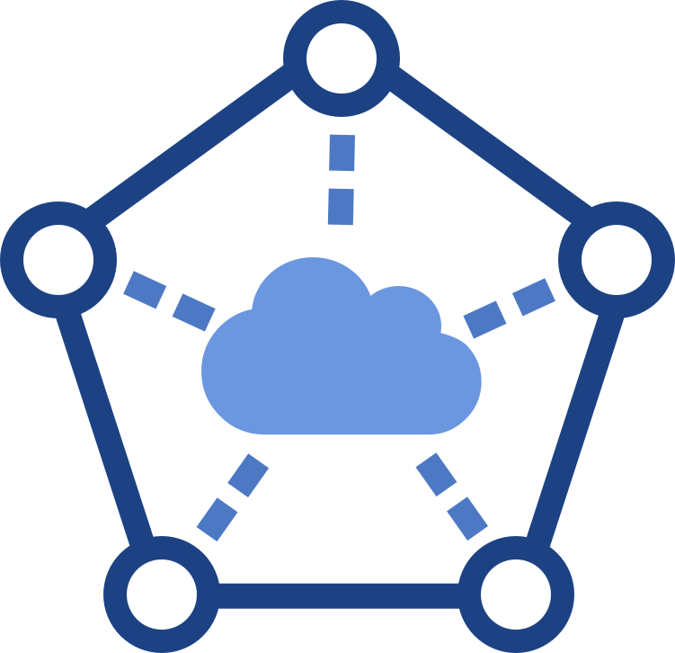
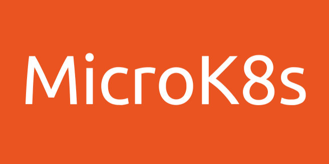
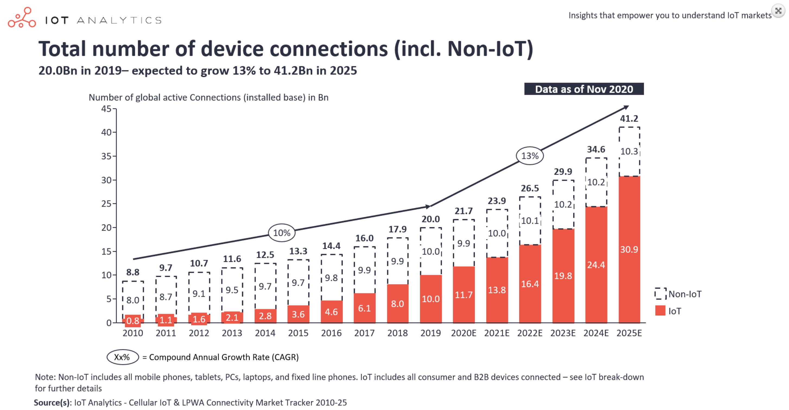
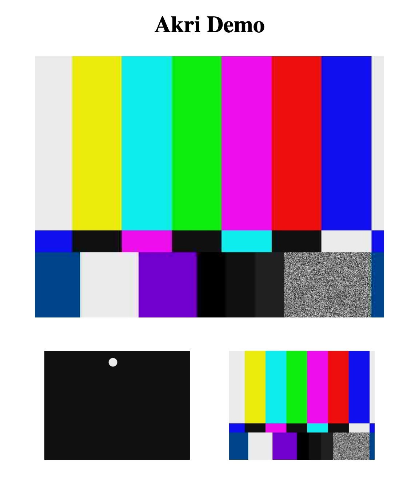
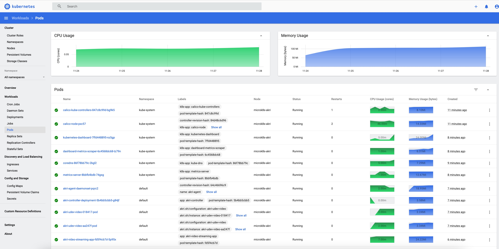
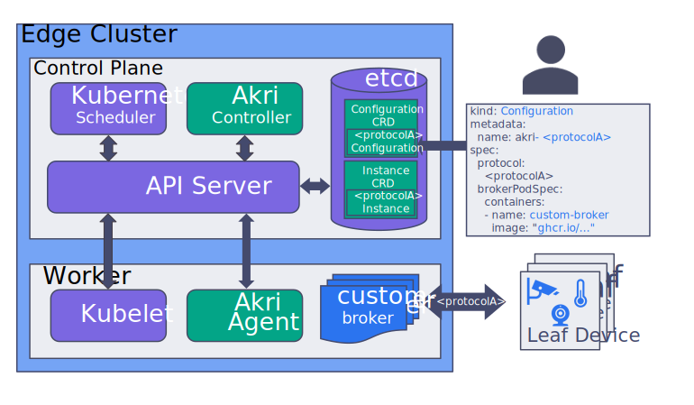
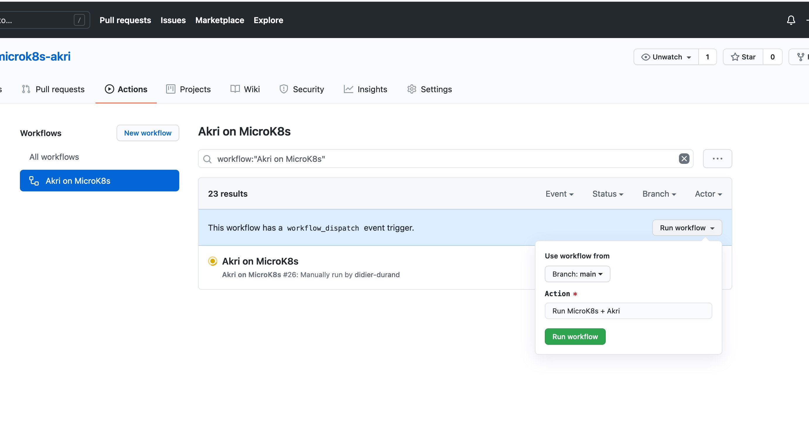

           

# Akri on MicroK8s

* [Goal](README.md#goal)
* [Kubernetes On The Edge - Akri Architecture](README.md#kubernetes-on-the-edge-akri-architecture)
* [Workflow Actions](README.md##workflow-actions)
* [Fork & Run](README.md#how-to-fork--run)
* [Execution Report](README.md#execution-report)
* [Akri Helm Chart](README.md#akri-helm-chart)

## Goal

This repository delivers a fully scripted workflow (install + run - based on [microk8s-akri.yml](.github/workflows/microk8s-akri.yml) and [microk8s-akri.sh](sh/microk8s-akri.sh)) on GitHub CI / CD of the [end-to-end demo](https://github.com/deislabs/akri/blob/main/docs/end-to-end-demo.md) recently published by the [Akri project](https://github.com/deislabs/akri): it illustrates the use of video cameras (mocked here by test video streams) in Kubernetes edge workloads. The badge above gives status of our last execution (see also section [Execution Report](README.md#execution-report) for log excerpts) and details for all previous runs can be found in the [Actions tab](https://github.com/didier-durand/microk8s-akri/actions). Section [Akri Helm Chart](README.md#akri-helm-chart) provides the fully expanded version of the K8s objects used in this showcase.

Akri by Microsoft follows the Greek-based naming tradition of the Kubernetes arena: "akri" means ["edge" in Greek](https://en.wiktionary.org/wiki/%CE%AC%CE%BA%CF%81%CE%B7). Interestingly, the Akri acronym can also stand for "A Kubernetes Resource Interface". So, it's now clear that the project is all about edge computing and the [Internet of Things (IoT)](https://en.wikipedia.org/wiki/Internet_of_things) with its [30+ billions of connected objects](https://iot-analytics.com/state-of-the-iot-2020-12-billion-iot-connections-surpassing-non-iot-for-the-first-time/) to emerge in next five years: 4 connected objects per human being worldwide in 2025 as predicted by IoT Analytics.

The workflow is also automatically scheduled by cron (see [microk8s-akri.yml](.github/workflows/microk8s-akri.yml)) on GitHub on a recurrent basis to validate that it keeps working properly while its various components keep evolving: new versions of Akri, MicroK8s, Ubuntu, etc. [MicroK8s defined as](https://microk8s.io/) *'autonomous, production-grade Kubernetes, on cloud, clusters, workstations, Edge and IoT'* is used here because its source code is extremely close to the upstream version of Kubernetes: this feature guarantees the widest possible range of use cases for those workloads making sophisticated use of the K8s features. We have already used it for same reasons in our scripted showcases for [Kube Bench](https://github.com/didier-durand/microk8s-kube-bench) and [Kata Containers](https://github.com/didier-durand/microk8s-kata-containers).

Section [Workflow Actions](README.md#workflow-actions) below details the sequence of actions needed to reach a working deployment starting from a fresh Ubuntu instance launched on Google Cloud Engine (GCE): we currently use a [n1-standard-4](https://cloud.google.com/compute/docs/machine-types#n1_machine_types) instance.

The workflow execution finally delivers the command(s) needed to obtain remote access on GCE to both the standard Kubernetes dashboard and the Akri demo application from the browser on your laptop: web pages similar to the ones below will be reached.

Feel free to fork and re-use! (Of course, if you like it, please, give it a star)

When you reach the end of workflow execution, you will be able to access, from your local browser two different applications produced by the pods of your MicroK8s cluster running on GCE. To allow port forwarding over ssh toward your laptop, you need to have gcloud SDK installed locally and to enter the following terminal command  `gcloud compute ssh microk8s-akri --zone=us-central1-c  --project=$GCP_PROJECT  --ssh-flag='-L 3443:localhost:3443 -L 12321:localhost:12321'`. Then,

1. `http://localhost:12321` will get you to the Akri demo application. At the bottom, permament images (updated at 1 fps) of the 2 fake cameras: the first with a bouncing ball, the second one with a colour carrousel. The top image shifts from one camera to the other every few seconds.
2. `http://localhost:3443` will get you to the standard Kubernetes dashboard showing all details above the 11 active pods. You need to obtain the security token from the final lines of the execution log to authentify with the dashboard.

   

(click on pictures above to enlarge them)

## Kubernetes On The Edge - Akri Architecture

Recent [announcement by NIVIDIA](https://nvidianews.nvidia.com/news/global-technology-leaders-adopt-nvidia-egx-edge-ai-platform-to-infuse-intelligence-at-the-edge-of-every-business) demonstrates that [Moore's Law](https://en.wikipedia.org/wiki/Moore%27s_law) remains in full force: installing a K8s microcluster on the edge is definitely possible now! The needed computing power with minimal form factor is available today and can serve even demanding edge ML / AI workloads.

One of the key differences between Kubernetes in the (public) cloud and Kubernetes on the edge is that, on the edge, workloads often require a variety of physical devices, like sensors, cameras and other leaf devices. Those leaf devices are single-purpose and limited: usually, no opportunity to load any additional software on them in order to make them multi-purpose or to become a member node of a Kubernetes cluster.

But the project team wanted those devices to remain easy to integrate with cloud-native workloads while keeping the resulting global system agile and flexible. So, they took the (_smart_) decision of treating the devices as resources and not compute nodes. Consequently, they designed some custom controllers and resources to dynamically discover the devices and expose them to applications as standard [Kubernetes Custom Resources](https://kubernetes.io/docs/concepts/extend-kubernetes/api-extension/custom-resources/), easy to access and manipulate using the standard mechanisms and features of the platform. 

Akri's architecture is very well depicted by the diagram below coming from the [project introductory blog post](https://cloudblogs.microsoft.com/opensource/2020/10/20/announcing-akri-open-source-project-building-connected-edge-kubernetes/).

This post details the various components in full detail: a must-read! The recent [presentation video](https://www.youtube.com/watch?v=ZbTLGuxH1UA) and [Edge conference slides](/doc/Edge-Conference-Slides.pdf) bring additional interesting information.

This architecture doesn't impose any overhead at all on the devices themselves. But, more importantly, at least to our mind, it keeps all software components of the global application within Kubernetes.

The interests are multiple: 
1. It keeps application developers, familiar with Kubernetes, in known territory: for edge workloads. they keep developing with K8s concepts, objects & APIs that they know very well for cloud applications.
2. It leverages the advantages of cloud-native architecture end to end: powerful abstraction of infrastructure, smallest possible lead time from dev to prod, automatic updates for new versions, etc. Operations remain fully homogeneous: the full edge stack can be managed by deployment and management mechanisms and tools (new container versions, compliance validation, etc.) already mastered for central workloads on cloud Kubernetes. So, no need to plan for additional processes and tools, specific to edge software that would reside outside of Kubernetes.
3. The use of advanced but standard features like [Custom Resources](https://kubernetes.io/docs/concepts/extend-kubernetes/api-extension/custom-resources/) and associated Controllers makes Akri easily extensible by the community. The team already announces the support of additional device protocols in upcoming releases: currently, [Open Network Video Interface Forum (ONVIF)](https://en.wikipedia.org/wiki/ONVIF) for IP cameras and [Linux udev (userspace /dev)](https://en.wikipedia.org/wiki/Udev) to manage hotplug-capable devices are supported. Beyond community contributions, the respect of the K8s standards will maximize Akri's composability, hence the added value that it delivers.

Regarding existing protocols, detailed instructions to configure the [Helm chart](https://helm.sh/docs/topics/charts/) for both protocols are provided: [udev configuration guide](https://github.com/deislabs/akri/blob/main/docs/udev-configuration.md) and [ONVIF configuration guide](https://github.com/deislabs/akri/blob/main/docs/onvif-configuration.md). The structure of the Helm chart itself is explained in the [Helm section of user guide](https://github.com/deislabs/akri/blob/01874e2b884f5ead11d00fe4c18dd3909adbeefa/docs/user-guide.md#understanding-akri-helm-charts) with full details regarding parameter values in [Helm variable declarations](https://github.com/deislabs/akri/blob/01874e2b884f5ead11d00fe4c18dd3909adbeefa/deployment/helm/values.yaml).

## Workflow Actions

This workflow is strongly inspired by the description and directives of the [end-to-end demo](https://github.com/deislabs/akri/blob/main/docs/end-to-end-demo.md) provided by project's Github repo. Please, refer to it for all details.

In our script, we add the automation around the canonical procedure to run it on a Google Cloud GCE. The workflow is driven by ssh commands executed from another Ubuntu machine provided by Github CI / CD. Thorough logging is also added to allow post-mortem analysis of the failing executions as the underlying environment changes: Github Actions, Ubuntu, Microk8s, Akri Helm chart and container images get installed at latest version on new runs. 

This additional logging can be suppressed if you prefer less verbose executions in your own use case. Additionally, [microk8s-akri.sh](sh/microk8s-akri.sh) can be run directly on your laptop: we use it as-is in MacOS terminal to execute the workflow on GCE without Github.

[**NB**: both sides of the shell scripting, GitHub and GCE, are contained in one bash file - uploaded by itself to GCE via scp - to more easily move and use it in different places]

Essentially, the sequence of actions to reach a working Akri demo from a fresh Ubuntu instance on GCE is:

1. Start, via [gcloud SDK](https://cloud.google.com/sdk/docs/install), the fresh GCE Ubuntu instance where Akri, GStreamer and MicroK8s will be installed.
2. Update all Ubuntu packages to their very last version via apt.
3. Upload the shell script to GCE for execution.
4. Install crictl, the [Container Runtime CLI](https://github.com/kubernetes-sigs/cri-tools/blob/master/docs/crictl.md) used by Akri's Helm Chart.
5. Install package for [v4l2loopback](https://github.com/umlaeute/v4l2loopback), the kernel module to create virtual video devices. ***IMPORTANT:*** version must be at least 0.12.5-1 (or newer) else GStreamer won't work: only Ubuntu 20.10 or newer comes with it upfront.
6. Load module v4l2loopback in the kernel and create the 2 fake camera devices.
7. Install [GStreamer](https://en.wikipedia.org/wiki/GStreamer).
8. Trigger reboot if needed (some updated packages may require it) and wait for return of the instance.
9.  Disconnect / reconnect to be able to use the authorizations granted via attachment to group 'microk8s'.
10. Reload v4l2loopback and recreate the 2 fake camera devices.
11. Launch as background process a different test video stream on each of the 2 cameras via GStreamer.
12. Activate the MicroK8s addons required by Akri: dns, rbac, dashboard and helm3.
13. Install Akri on MicroK8s via its Helm chart, with proper parameters to activate udev and discover devices.
14. Validate proper deployment of the chart by checking availability of the installed Kubernetes objects.
15. Deploy the sample video application.
16. Validate its proper operations.

When all those steps have successfully completed, both the standard Kubernetes dashboard and the Akri sample video application can be accessed remotely on GCE from your laptop via your favorite browser using the directives and values provided at end of execution log. The security token required for access to the dashboard and taken from the generated kubectl config is also provided.

## Fork & Run

To start, you need a Google Cloud account including a project where the GCE APIs have been enabled. Obtain the id of your project from 
GCP dashboard. Additionally, you need to create in this project a service account (SA) and give it proper GCE credentials: right to create, administer and delete GCE images & instances (if your cannot make the SA a "Project Owner" to simplify the security aspects...). Save the private key of the SA in json format.

Then, fork our repository and define the required [Github Secrets](https://docs.github.com/en/actions/reference/encrypted-secrets) in your fork: 

1. your GCP project id will be {{ secrets.GCP_PROJECT }}
2. The private key of your service account in json format will be ${{ secrets.GCP_SA_KEY }} 

To easily use the workflow from Github, you can launch it with the [manual dispatch feature of Github](https://github.blog/changelog/2020-07-06-github-actions-manual-triggers-with-workflow_dispatch/) that you can see as a launch button (the green one in the picture below) in the Action tab of your fork.

The workflow will execute all the steps described above and keep the instance up and running for further exploration. Up to you to delete it via Google Cloud console when it's no longer needed. When scheduled automatically, it will terminate gracefully after all validation tests described are completed: it will then delete the GCE instance. 
